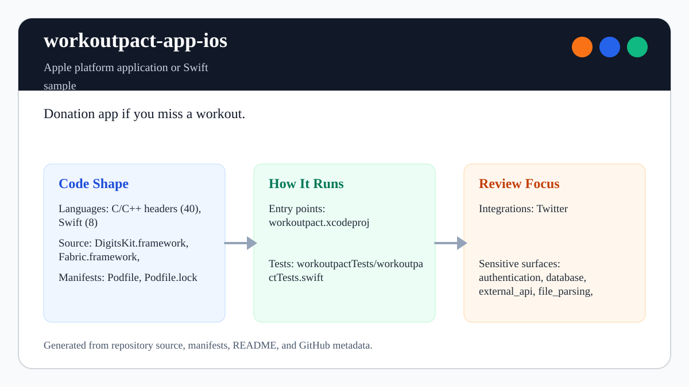

# workoutpact-app-ios

<!-- README-OVERVIEW-IMAGE -->


## Overview

`garethpaul/workoutpact-app-ios` is an Apple platform application or Swift sample. Donation app if you miss a workout.

This README is based on the checked-in source, manifests, scripts, and repository metadata on the `master` branch. The project language mix found during review was: C/C++ headers (40), Swift (8).

## Repository Contents

- `Podfile` - Apple platform dependency metadata
- `DigitsKit.framework` - source or example code
- `Fabric.framework` - source or example code
- `Podfile.lock` - Apple platform dependency metadata
- `SECURITY.md` - security reporting and disclosure guidance
- `TwitterCore.framework` - source or example code
- `TwitterKit.framework` - source or example code
- `VISION.md` - project direction and maintenance guardrails
- `workoutpact` - source or example code
- `workoutpact.xcodeproj` - Xcode project file
- `workoutpactTests` - source or example code

Additional scan context:

- Source directories: DigitsKit.framework, Fabric.framework, TwitterCore.framework, TwitterKit.framework, workoutpact, workoutpactTests
- Dependency and build manifests: Podfile, Podfile.lock
- Entry points or build surfaces: workoutpact.xcodeproj
- Test-looking files: workoutpactTests/workoutpactTests.swift

## Getting Started

### Prerequisites

- Git
- macOS with Xcode for building Apple platform projects
- CocoaPods if dependencies need to be installed

### Setup

```bash
git clone https://github.com/garethpaul/workoutpact-app-ios.git
cd workoutpact-app-ios
pod install
```

The setup commands above are derived from repository files. Legacy mobile, Python, or JavaScript samples may require older SDKs or package versions than a modern workstation uses by default.

## Running or Using the Project

- Open `workoutpact.xcodeproj` in Xcode, choose the app or sample scheme, and run it on the matching simulator/device.

## Testing and Verification

- `make check` - runs dependency-free static contracts and attempts an Xcode build only when `xcodebuild` and `Pods/` are available
- `make verify` - runs the WorkoutPact metadata, privacy, auth, payment-token,
  payment input, payment-button, payment-key, payment-error logging, and
  storyboard navigation and protected-screen outlet static contracts
- Completed maintenance plans live under `docs/plans` and are checked by
  `make check`.
- Xcode's test action or `xcodebuild test` with the appropriate scheme and destination

When the required SDK or runtime is unavailable, use static checks and source review first, then verify on a machine that has the matching platform toolchain.

## Configuration and Secrets

- Detected references to Twitter. Keep API keys, OAuth credentials, tokens, and account-specific values in local configuration only.
- `workoutpact/Info.plist` contains placeholder URL scheme metadata only. Replace placeholder Twitter/Digits/Fabric values locally when running the legacy prototype, and do not commit real credentials.
- `workoutpact/Info.plist` contains an empty `StripePublishableKey` placeholder. Configure a real `pk_` publishable key locally and keep billing disabled unless a backend contract and tests exist.
- The shake-to-share flow should always require explicit user confirmation before opening Twitter composition.

## Security and Privacy Notes

- Review changes touching authentication or token handling; examples from the scan include DigitsKit.framework/Headers/DGTAuthenticateButton.h, DigitsKit.framework/Headers/DGTContacts.h, DigitsKit.framework/Headers/DGTOAuthSigning.h, DigitsKit.framework/Headers/DGTSession.h, and 6 more.
- Review changes touching external API calls or credential-adjacent configuration; examples from the scan include DigitsKit.framework/Headers/DGTAppearance.h, DigitsKit.framework/Headers/DGTAuthenticateButton.h, DigitsKit.framework/Headers/DGTContactAccessAuthorizationStatus.h, DigitsKit.framework/Headers/DGTContacts.h, and 6 more.
- Review changes touching network requests, sockets, or service endpoints; examples from the scan include TwitterCore.framework/Headers/TWTRAPIErrorCode.h, TwitterCore.framework/Headers/TWTRAuthConfig.h, TwitterCore.framework/Headers/TWTRCoreOAuthSigning.h, TwitterKit.framework/Headers/TWTRAPIClient.h, and 3 more.
- Review changes touching mobile permissions or privacy-sensitive device data; examples from the scan include DigitsKit.framework/Headers/DGTContactAccessAuthorizationStatus.h, DigitsKit.framework/Headers/DGTContacts.h, DigitsKit.framework/Headers/DGTContactsUploadResult.h, DigitsKit.framework/Headers/DGTErrors.h, and 1 more.
- Review changes touching file, media, JSON, XML, CSV, OCR, or data parsing; examples from the scan include DigitsKit.framework/Headers/DGTContacts.h, DigitsKit.framework/Headers/DGTContactsUploadResult.h, TwitterCore.framework/Headers/TWTRConstants.h, TwitterCore.framework/Headers/TWTRCoreOAuthSigning.h, and 6 more.
- Review changes touching database, model, or persistence code; examples from the scan include TwitterKit.framework/Headers/TWTRTweetTableViewCell.h, TwitterKit.framework/Headers/TWTRTweetViewDelegate.h.

## Maintenance Notes

- This looks like an Apple platform project or sample. Xcode, Swift, CocoaPods, and deployment target versions may need to match the original project era.
- See `SECURITY.md` for vulnerability reporting and safe research guidance.
- See `VISION.md` for project direction and contribution guardrails.
- See `docs/plans/2026-06-08-workoutpact-build-privacy-contracts.md` and
  `docs/plans/2026-06-08-workoutpact-auth-payment-sharing-guards.md` for the
  current build, privacy, auth, payment, and sharing baselines.
- See `docs/plans/2026-06-08-workoutpact-logout-navigation-guard.md` for the
  logout navigation guard contract.
- See `docs/plans/2026-06-08-workoutpact-payment-button-guard.md` for guarded
  payment submit-button state updates.
- See `docs/plans/2026-06-09-workoutpact-payment-input-guard.md` for guarded
  PaymentKit input access before tokenization.
- See `docs/plans/2026-06-09-workoutpact-storyboard-cast-guards.md` for guarded
  storyboard controller casts in login and logout navigation.
- See `docs/plans/2026-06-09-workoutpact-payment-error-log.md` for
  non-sensitive Stripe tokenization failure logging.
- See `docs/plans/2026-06-09-workoutpact-payment-key-guard.md` for stopping
  tokenization when no local Stripe publishable key is configured.
- See `docs/plans/2026-06-09-workoutpact-textfield-outlet-guard.md` for the
  protected screen text-field outlet guard.

## Contributing

Keep changes small and tied to the project that is already present in this repository. For code changes, document the toolchain used, avoid committing generated dependency directories or local configuration, and update this README when setup or verification steps change.
